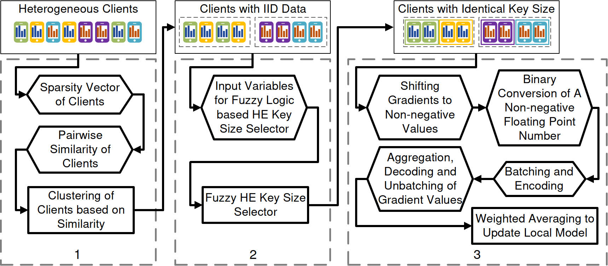
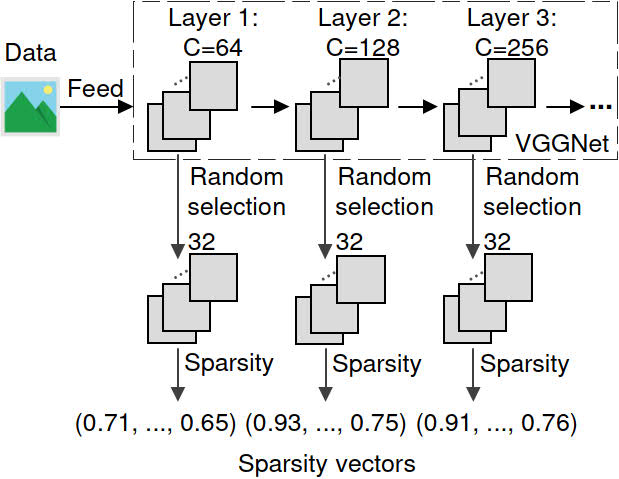
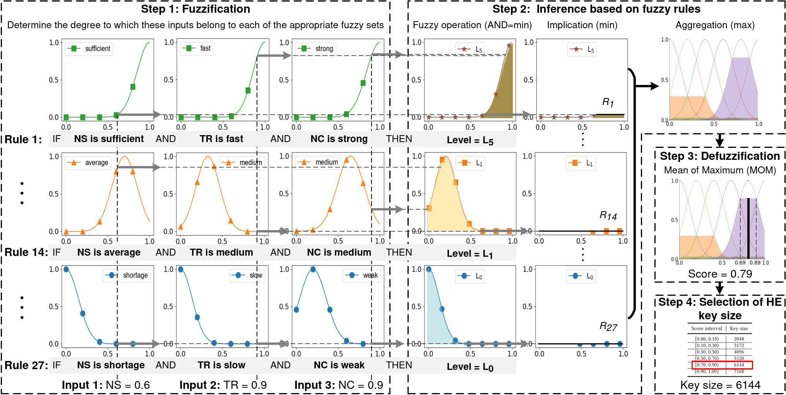
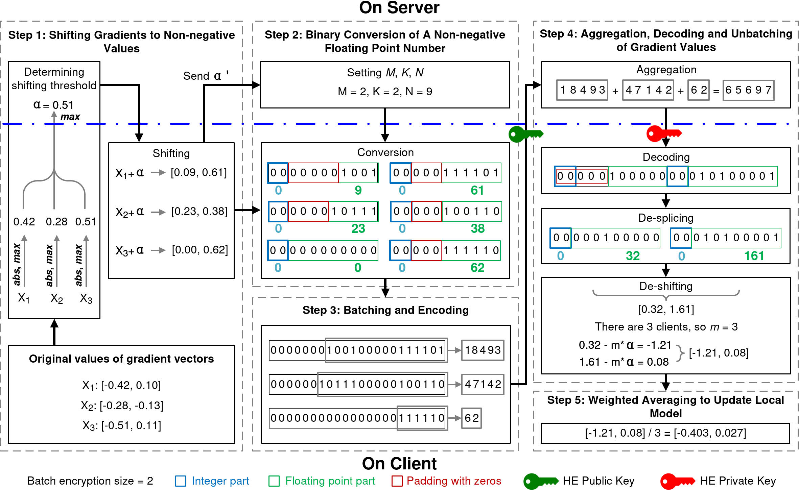

# AdaptiveBatchHE

<!-- start intro -->

This repository provides the implementation of the paper ["Adaptive Batch Homomorphic Encryption for Joint Federated Learning in Cross-Device Scenarios"](https://ieeexplore.ieee.org/document/10275042), which is published in IEEE INTERNET OF THINGS JOURNAL. In this paper, we propose an adaptive batch HE framework for cross-device FL, which determines cost-efficient and sufficiently secure encryption strategies for clients with heterogeneous data and system capabilities.

Our framework consists of the following three key components:
  

<!-- end intro -->

## Clustering of Clients based on Sparsity of CNNs

The code in the folder *cnn sparsity* is used to obtain the sparse vectors of the client.

`federated_main.py` is the main function.

The input is the path of the dataset.

## Selection of HE Key Size for Each Client based on Fuzzy Logic

The code in the folder *fuzzy logic* is used to obtain the key size of the client.

`fuzzy_logic_main.py` is the main function.

There are three input, namely, input_NS, input_TR, and input CC.

Their values are between 0 and 1.

## Accuracy-lossless Batch Encryption and Aggregation

The code in the folder *batch encryption* is used to train model.

`federated_experiment_main.py` is the main function.

This component is used for batch encryption under FL training. 

The details of the three components are shown in the paper.

## Prerequisites

To run the code, it needs some libraies:

- Python >= 3.8
- Pytorch >= 1.10
- torchvision >= 0.11
- phe >= 1.5

Our environment is shown in the file, named `environment.yaml`.

