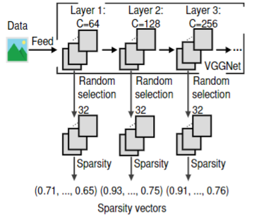
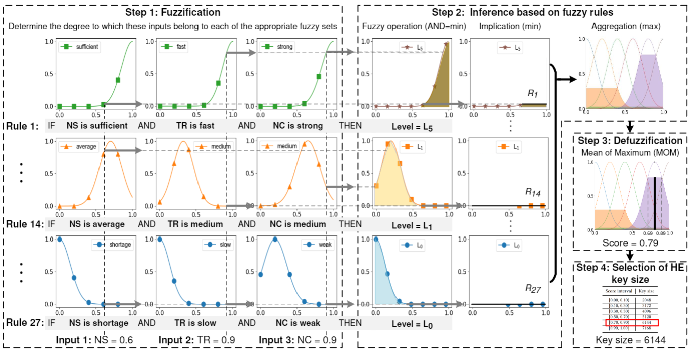
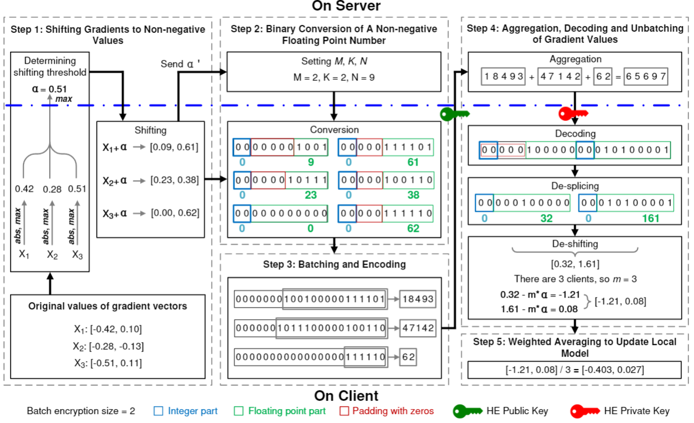

# AdaptiveBatchHE

This repository is for our IEEE IOT-J 2023 paper "Adaptive Batch Homomorphic Encryption for Joint Federated Learning in Cross-Device Scenarios". 

Goals of this repository:

- Provide a simple description for our work
- Help readers understand and replicate our work

Our framework consists of the following three key components.

## Clustering of Clients based on Sparsity of CNNs

The code in the folder *cnn sparsity* is used to obtain the sparse vectors of the client.

`federated_main.py` is the main function.

The input is the path of the dataset.

## Selection of HE Key Size for Each Client based on Fuzzy Logic

The code in the folder *fuzzy logic* is used to obtain the key size of the client.

`fuzzy_logic_main.py` is the main function.

There are three input, namely, input_NS, input_TR, and input CC.

Their values are between 0 and 1.

## Accuracy-lossless Batch Encryption and Aggregation

The code in the folder *batch encryption* is used to train model.

`federated_experiment_main.py` is the main function.

This component is used for batch encryption under FL training. 

The details of three components are shown in the paper.

## Prerequisites

To run the code, it needs some libraies:

- Python >= 3.8
- Pytorch >= 1.10
- torchvision >= 0.11

Our environment is shown in the file, named `environment.yaml`.

