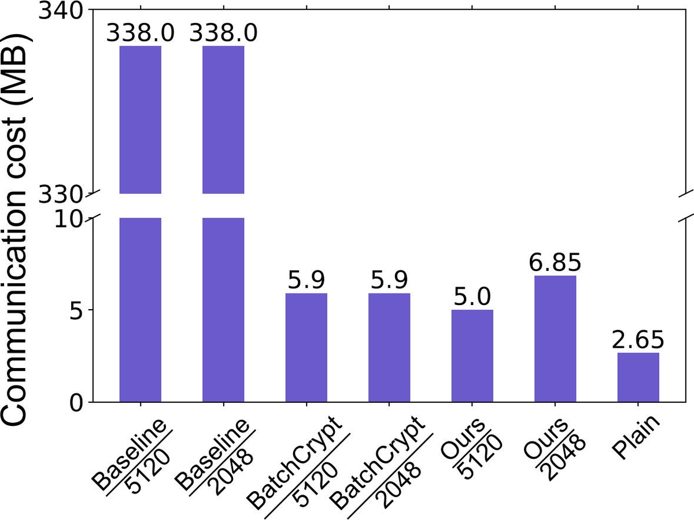

# AdaptiveBatchHE

<!-- start intro -->

This repository provides the implementation of the paper ["Adaptive Batch Homomorphic Encryption for Joint Federated Learning in Cross-Device Scenarios"](https://ieeexplore.ieee.org/document/10275042), which is published in IEEE INTERNET OF THINGS JOURNAL. In this paper, we propose an adaptive batch HE framework for cross-device FL, which determines cost-efficient and sufficiently secure encryption strategies for clients with heterogeneous data and system capabilities. Our framework can achieve comparable accuracy to plain HE (i.e., encryption applied per gradient), while reducing training time by 3×-31×, and communication cost by 45×-66×.

<table>
  <tr>
    <td width="25%"></td>
    <td width="25%"></td>
    <td width="25%"></td>
    <td width="25%"></td>
  </tr>
  <tr>
    <td width="25%">Training time over 100 epochs</td>
    <td width="25%">Testing accuracy over epochs</td>
    <td width="25%">Communication cost in one epoch</td>
    <td width="25%">Cost efficiency under various HE key sizes</td>
  </tr>
</table>


Our framework consists of the following three key components:

<p align="center">

</p>

<!-- end intro -->

## 1. Clustering of Clients based on Sparsity of CNNs

<!-- start sparsity -->

<p align="center">

</p>

The code in the folder [CNN Sparisty](https://github.com/liyan2015/AdaptiveBatchHE/tree/main/CNN%20Sparisty) is for determining the sparsity vectors of clients.

`federated_main.py` is the main function.

The input is the path of the dataset.

<!-- end sparsity -->

## 2. Selection of HE Key Size for Each Client based on Fuzzy Logic

<!-- start fuzzy -->

<p align="center">

</p>

The code in the folder [fuzzy logic](https://github.com/liyan2015/AdaptiveBatchHE/tree/main/fuzzy%20logic) is for determining the HE key size of clients.

`fuzzy_logic_main.py` is the main function.

There are three inputs: `input_NS`, `input_TR`, and `input_CC`.

Their values are between 0 and 1.

<!-- end fuzzy -->

## 3. Accuracy-lossless Batch Encryption and Aggregation

<!-- start batch -->

<p align="center">

</p>

The code in the folder [batch encryption](https://github.com/liyan2015/AdaptiveBatchHE/tree/main/batch%20encryption) is for accuracy-lossless batch encryption and aggregation of model parameters for FL training.

`federated_experiment_main.py` is the main function.

The code needs a proper hyperparameter K to run correctly, of which reason has been explained with detail in the paper. The default K value is 4. For specific settings, please refer to the comments in the code.

<!-- end batch -->

## Prerequisites

To run the code, it needs some libraies:

- Python >= 3.8
- Pytorch >= 1.10
- torchvision >= 0.11
- phe >= 1.5
- skfuzzy >= 0.4

Our environment is shown in the file, named `environment.yaml`.

## Citing

<!-- start citation -->

If you use this repository, please cite:
```bibtex
@article{han2023adaptiveBatchHE,
  title={Adaptive Batch Homomorphic Encryption for Joint Federated Learning in Cross-Device Scenarios},
  author={Han, Junhao and Yan, Li},
  journal={IEEE Internet of Things Journal},
  volume={11},
  number={6},
  pages={9338--9354},
  year={2023},
}
```
List of publications that cite this work: [Google Scholar](https://scholar.google.com/scholar?oi=bibs&hl=en&cites=6612438289564584629)

<!-- end citation -->

